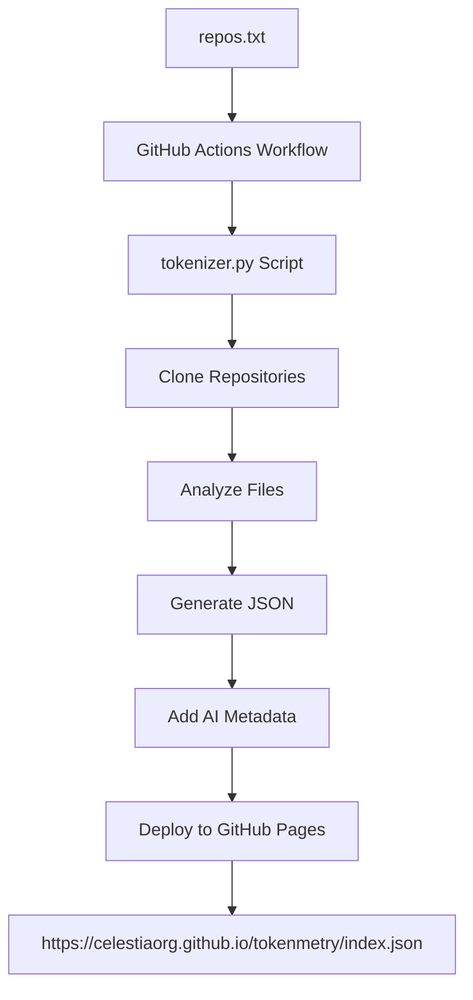

# Token Telemetry System

A comprehensive token analysis system for CelestiaOrg repositories, designed to help AI agents understand codebase size, complexity, and structure for better context management and development assistance.

## 🎯 Purpose

This system automatically analyzes CelestiaOrg repositories and provides detailed token counts using the GPT-2 tokenizer. The results are published as a JSON API that AI agents can consume to make informed decisions about context window management, repository prioritization, and code analysis strategies.

## 🚀 Live API

**Endpoint:** `https://celestiaorg.github.io/tokenmetry/index.json`

The JSON includes comprehensive metadata, usage instructions, and detailed token analysis for all configured repositories.

## 📊 What's Analyzed

The system analyzes repositories configured in `repos.txt`. Current analysis results:

<!-- TOKENMETRY_TABLE_START -->
| Repository | Total Files | Total Tokens | Go Files | Go Tokens | Markdown Files | Markdown Tokens |
|------------|-------------|--------------|----------|-----------|----------------|-----------------|
| celestia-core | 1179 | 3,202,991 | 709 | 2,496,398 | 470 | 706,593 |
| celestia-app | 436 | 937,662 | 356 | 671,589 | 80 | 266,073 |
| celestia-node | 494 | 736,663 | 475 | 697,375 | 19 | 39,288 |
| rsmt2d | 14 | 40,074 | 13 | 38,942 | 1 | 1,132 |
| **TOTAL** | **2123** | **4,917,390** | **1553** | **3,904,304** | **570** | **1,013,086** |

**Last Updated:** 2025-06-17 15:03:48 UTC
<!-- TOKENMETRY_TABLE_END -->

**File Types:** `.go` (Go source code) and `.md` (Markdown documentation)

## 🏗️ System Architecture



## 🔧 Components

### Core Files

- **`tokenizer.py`** - Main Python script for token analysis
- **`repos.txt`** - Configuration file listing repositories to analyze
- **`.github/workflows/tokenizer.yml`** - GitHub Actions workflow for automation
- **`pyproject.toml`** - Poetry dependency management

### Key Features

- **GPT-2 Tokenizer** - Consistent token counting across all content
- **Repository Cloning** - Shallow clones for efficient analysis
- **File-level Analysis** - Detailed breakdown of individual files
- **AI-Optimized Output** - Metadata and usage instructions for AI agents
- **Automated Deployment** - Daily updates and on-demand execution

## 🤖 AI Agent Usage

### Quick Start
```python
import requests

# Fetch token telemetry data
response = requests.get('https://celestiaorg.github.io/tokenmetry/index.json')
data = response.json()

# Get overall statistics
total_tokens = data['summary']['total_tokens']
total_repos = data['summary']['total_repositories']

# Discover available repositories
for repo in data['repositories']:
    name = repo['repository']['name']
    url = repo['repository']['url']
    tokens = repo['total_tokens']
    print(f"{name}: {tokens:,} tokens")
```

### Context Management Strategies

1. **Repository Prioritization**
   ```python
   # Sort repositories by size for context planning
   repos_by_size = sorted(data['repositories'], 
                         key=lambda x: x['total_tokens'])
   ```

2. **File Analysis**
   ```python
   # Find largest files that might need chunking
   for repo in data['repositories']:
       large_files = [f for f in repo['files'] if f['tokens'] > 5000]
   ```

3. **Language Breakdown**
   ```python
   # Understand code vs documentation ratio
   go_tokens = data['summary']['by_extension']['.go']['tokens']
   md_tokens = data['summary']['by_extension']['.md']['tokens']
   ```

## 🛠️ Local Development

### Prerequisites

- Python 3.9+
- Poetry
- Git

### Setup

```bash
# Clone the repository
git clone https://github.com/celestiaorg/tokenmetry.git
cd tokenmetry

# Install dependencies
poetry install

# Run analysis on all configured repositories
poetry run python tokenizer.py --celestia-repos --output results.json

# Analyze a single repository
poetry run python tokenizer.py --repo https://github.com/celestiaorg/celestia-app.git

# Analyze a local directory
poetry run python tokenizer.py --directory /path/to/repo

# Analyze a single file
poetry run python tokenizer.py --file example.go
```

### Command Line Options

```
usage: tokenizer.py [-h] (--file FILE | --directory DIRECTORY | --repo REPO | --celestia-repos | --text TEXT)
                    [--repo-file REPO_FILE] [--output OUTPUT] [--verbose]

options:
  --file, -f           Path to file to tokenize
  --directory, -d      Path to directory to process
  --repo, -r           Repository URL to clone and process
  --celestia-repos     Process all repositories from repos.txt
  --text, -t           Text string to tokenize
  --repo-file          Path to repository list file (default: repos.txt)
  --output, -o         Output JSON file path
  --verbose, -v        Show detailed file-by-file results
```

## 📝 Configuration

### Adding Repositories

Edit `repos.txt` to add or remove repositories:

```
# CelestiaOrg Repository List
# One repository URL per line
# Lines starting with # are comments

https://github.com/celestiaorg/celestia-core
https://github.com/celestiaorg/celestia-app
https://github.com/celestiaorg/celestia-node
https://github.com/celestiaorg/docs
```

Changes to `repos.txt` automatically trigger workflow runs.

### GitHub Pages Setup

1. Go to repository **Settings** → **Pages**
2. Set **Source** to **"GitHub Actions"**
3. The workflow will handle deployment automatically

## 🔄 Automation

### Workflow Triggers

- **📅 Scheduled:** Daily at 6 AM UTC
- **👆 Manual:** Via GitHub Actions UI ("Run workflow" button)
- **🔧 Automatic:** On changes to:
  - `tokenizer.py`
  - `.github/workflows/tokenizer.yml`
  - `repos.txt`

### Manual Execution

1. Go to **Actions** tab in GitHub
2. Select **"Token Telemetry"** workflow
3. Click **"Run workflow"**
4. Select branch and click **"Run workflow"**

## 📊 Output Format

### JSON Structure

```json
{
  "metadata": {
    "generated_at": "2025-06-17T14:00:00Z",
    "purpose": "Token analysis for AI context management",
    "usage_instructions": { /* AI guidance */ },
    "data_structure": { /* Format explanation */ }
  },
  "summary": {
    "total_repositories": 4,
    "total_files": 2123,
    "total_tokens": 4917390,
    "by_extension": {
      ".go": { "files": 1553, "tokens": 3904304 },
      ".md": { "files": 570, "tokens": 1013086 }
    }
  },
  "repositories": [
    {
      "directory": "celestia-core",
      "repository": {
        "name": "celestia-core",
        "url": "https://github.com/celestiaorg/celestia-core"
      },
      "total_files": 1179,
      "total_tokens": 3202991,
      "by_extension": { /* breakdown by file type */ },
      "files": [ /* individual file analysis */ ]
    }
  ]
}
```

## 🔍 Monitoring

### Workflow Status

Check workflow runs in the **Actions** tab to monitor:
- Execution success/failure
- Processing time
- Token count changes over time

### Error Handling

The system includes robust error handling:
- Repository cloning failures are logged but don't stop other repositories
- File encoding issues are skipped with warnings
- Network timeouts are retried automatically

## 🤝 Contributing

### Adding New File Types

Edit `tokenizer.py` to support additional file extensions:

```python
# In count_tokens_in_file function
if extension not in ['.go', '.md', '.rs', '.py']:  # Add new extensions
    return 0, extension
```

### Improving Analysis

Consider enhancements like:
- Language-specific token analysis
- Code vs comment separation
- Historical trend tracking
- Performance optimizations

## 📄 License

This project is part of the CelestiaOrg ecosystem. See individual repository licenses for details.

## 🆘 Support

For issues or questions:
1. Check the **Actions** tab for workflow failures
2. Review the **Issues** tab for known problems
3. Create a new issue with detailed information

---

**Last Updated:** Auto-generated daily at 6 AM UTC  
**API Endpoint:** https://celestiaorg.github.io/tokenmetry/index.json
